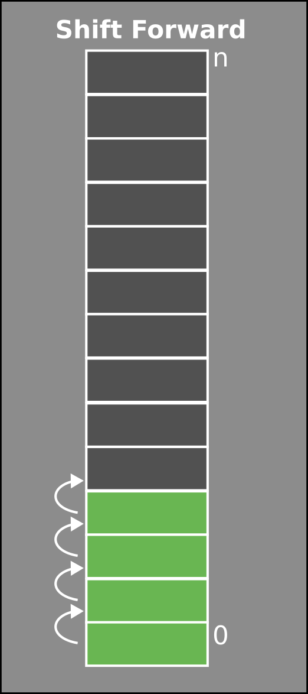
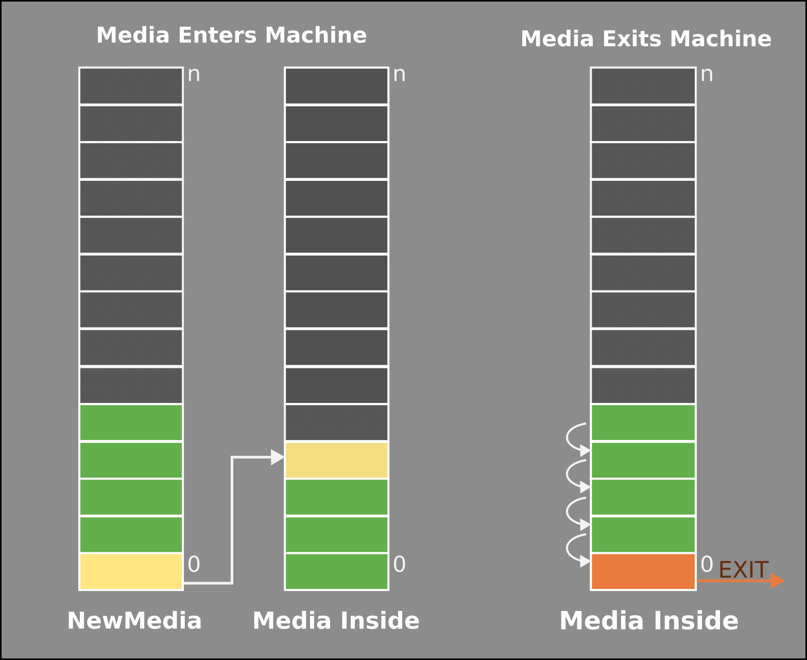

# Media Control

This document explains the media control in the EFI machines. Printer, Dryer and the machines using this ExtPack.

The main scope of this feature is controlling the position and the height of the media inside the machine, considering up to 2 lines in DTP configuration.

With the stack functionality, the machine will be receiving the information of each media before entering the machine, so detailed control of needs can be achieved.

The main functionalities of this Package are:

- Thickness of the blocks

- Activation of Curing (white and color)

- Activation of Drying

- Power of Drying needed

# Notation

`Variable_In_AutomationStudio` or `Method_In_OpcUa`

<mark>Program_In_AutomationStudio</mark>

**Action_In_AutomationStudio**

# Preliminary

Originally, this functionality was just working with arrays, defining the position of the media and the minimum allowed value for the position of the bars. At this point, only the concept of Continuous Media was considered.

The MediaTracking functionality takes the information of the media is entering in the machine and manage the position of each individual media inside the machine. This functionality is need for advance functionalities as DDC (Dynamic Duty Cycle) for Dryer and can be use for Curing and visualization too.

As the need of controlling individual and different media in the printer appeared (mainly for Cube), the NewMediaStack functionality was added. With this functionality, the machine needs to know the media will be entering in the machine. That information will come through an OpcUa Method as `LoadNewMedia` or `LoadNewMediaEnergy`.

# Program's Architecture

One of the main goals of this feature is consuming as less resources as possible. To achieve it, all the different packages related have been splitted between Fast and Slow programs:

- Fast programs are run with maximum desired speed, so they are defining the maximum information that is managed.

- Slow programs move the information from the Fast programs into the correspondent arrays.

- The result of dividing slow programs Cycle Times between Fast Program Cycle times MUST be an integer and inferior to 10.
  
  - 4ms and 12ms [3] is allowed
  
  - 2ms and 10ms [5] is allowed
  
  - 4ms and 10ms [2.5] is NOT allowed
  
  - 2ms and 22ms [11] is NOT allowed

## Fast Programs

Fast sensor programs read the information directly form the sensors and store it in their status values.

<mark>ThicknessCtrl_Fast</mark> takes the information from the sensor programs and stores them inside internal arrays for them to be managed later by the slow program.

## Slow Programs

Slow sensor programs manage the non critical and fast information from each type. Homing, slow alarms, communications and others are managed here.

<mark>ThicknessCtrl</mark> is the main program for this functionality. It takes the information from the fast program and moves it into the arrays where the information is treated.

The arrays have a resolution of 1cm, so each position in the array corresponds to 1cm. In the different arrays is stored the presence/absence of some media and the thickness value required for the system.

One key point of the implementation is be receptive to gaps. If the fast program detects a gap, when moving the information to the slow programs, a gap MUST appear, to assure a proper management of the start and the end of each media

## Programs List

The main program is <mark>ThicknessCtrl</mark>. This is the program that collects the data from the different programs, which take the value of the presence and the thickness of the media entering the machine:

- <mark>ThicknessCtrl </mark>[MAIN]

- <mark>nSensorCtrl </mark>[Array of digital sensors with a motor to moving them]

- <mark>AnalogThicknessCtrl </mark>[Analog sensor array]

- <mark>BasicMediaDetect </mark>[Just detecting presence and not thickness of media]

# Basic Operation

The main functionality is running in the <mark>ThicknessCtrl</mark> program. This is the main Slow program of the package.

When the Belt is running and the speed is higher than minimum, the program calculates the `iPositionsToRunArray`. This is a key point in the program. The centimeters that the arrays has to be moved, considering the speed of the belt and the program cycle.

If  `iPositionsToRunArray > 0`, then the program moves the arrays to consider the new desired position of the data. The arrays are shifted with the function `ShiftArrayForward` a certain number of positions determined by `iPositionstoRunArray`. This action moves all the elements towards the end of the array that number of positions.

- **RunHeightArray** manages the thickness of the media with `iHeightArray`

- **RunMediaArray** manages the presence of media with `xMediaTracking`

## RunHeightArray

This Action moves the information in  `iHeightArray` and loads the height from the sensor information depending on the system installed in the machine.

After moving/shifting and loading new data, the maximum thickness per each enabled section is calculated. Each section is used by one block to define the minimum position the block can be positioned.

### Sections

Sections are defined for when a machine has more than one block or area. This way, the height can be controlled independently for each one of them. Each section would be updated with the minimum vertical position needed to avoid crash.

## RunMediaArray

This Action shifts the information inside `xMediaTracking`, then filters, checks and loads the new values from the source of the media inside this array.

`xMediaTracking` will then contain information of the presence of media all along the distance  considered in each machine.

Media data presence is filtered to avoid false positives (ink in the belt) and it is checked for consistency

## Position Array

The ***PositionArray*** file is an aggrupation of functions that recalculate distances to adjust them to the current position of the pieces taking into account `iPositionToRunArray`, which is the distance that the pieces move within a cycle period, and it is calculated in function of the belt speed and the cycle period.

The feature works in one centimeter steps, but yet the distance can take a non-integer value. So between cycles, the distance gained can have some decimals to it. Those extra distances cannot be directly added and are instead added up to a buffer and only when that addition exceeds the unit, the integer part is added for compensation.

# Media Tracking

This functionality consists in tracking the pieces that pass through the machine, taking account of the presence and absence of pieces to identify gaps and differentiate pieces between them.

`xMediaTracking` is the array over this functionality operates and the process is as follows:

This function detects whenever a piece enters the machine, and also calculates the number of pieces inside.

The information tracked by the functionality is the media data (thickness, dimensions, white, energy, etc.) plus the important information for tracking. This information is stores in `MediaTrackingInsideL1 `and `MediaTrackingInsideL2`.

- `HeadPosition` for tracking the position head of the media and and managing functions like curing activation timing and drying.

- `TailPosition` for tracking the tail position of the media. A `TailPosition = 0` is considered a media still entering in the machine.

In case either the Curing or Drying functionalities are enabled in MediaTracking, it will also take into account inside positions and check for exiting media.

## CureTracking

***CureTracking*** contains functions for activating  the curing lamps only if one piece is under the lamps.

When *MediaControl* is enabled, the program will have the curing lamps on when any portion of a piece is under the curing window. This is a diagram explaining the possible states of a piece in relation to the curing lamps (*Curing Window*) and the state of the lamps.

- On **State A** the piece has not arrived to the curing yet. So the lamps will be **OFF**

- On **States labeled with a B**, where there is a piece below he Curing Window (in the case of **B.1** it is only the head, in the case of **B.3** it is only the tail, but that does not matter), so the lamps must be **ON**

- On **State C**, the whole piece has exited the area below the Curing Window, so the leds can be set **OFF** again.

## DryTracking

The DryTracking functionality is an extra functionality of the MediaTracking. When it is activated, besides to the media itself, it is received the information of the Energy needed to Dry the media. This information can come from the Stack functionality or from the ContinuousMedia structure.

### With Stack Functionality

When Stack is activated, the Energy information is place in the `MediaEnergyRackL1`  or `MediaEnergyRackL2` when loaded the information to the Stack.

When the media enters in the machine, the Media is assigned to MediaTrackingInsideL1 with the media itself and the pointer to the Energy information.

### Without Stack. Continuous Media

When Stack is NOT activated, the Energy information is place in the `MediaEnergyRackL1` or `MediaEnergyRackL2` from `ContinuousMedia.Energy` when entering media to the machine

# New Stack Media

This feature operates by the principle of a FIFO (First In First Out) queue, which means that the first piece to enter the queue is the first one to be treated.
Press Software supplies data about the media that will be entering the machine, which are then stored inside an array along all the other data necessary when the media enters the machine. 

Some of the more important parameters are:

- **Thickness**: for the machine to adjust the height of the bars.
- Need of **white Ink** depending on whether the piece needs it or not, the **curing LEDs** for white will need to turn on or not, this way having them on all the time can be avoided.

This functionality is implemented in the action **MediaTracking**.  The main actions inside this main action are:

* **CheckFinishEnteringMedia**: Review end of media currently entering. Assign `TailPosition`

* **CheckEnteringMedia**: Review  start of the media. Assign `HeadPosition`

* **RunMediaInsidePositions**; Increase the values of `HeadPosition `and `TailPosition`

* **CheckExitingMedia**: Review the media exiting of the machine

### Moving elements between arrays

When some new media enters (if stack is enabled for detection) the first item from the `NewMediaStackLX` array has to be moved into the last position of `InsideMediaStackLX`. When doing so, the first position remains empty, so all the elements inside `NewMediaStackLX` have to be shifted towards the beginning of the array.

This is done with the `ShiftArrayBackward` action, that moves all the elements inside an array towards the beginning.

## Reject tracking

The feature also track rejected pieces. It stores the *validity* of the pieces inside another array called `ValidMedia`.

## Alarms

Mainly, there is one new alarm defined: *"NoThicknessInstalled"*, which detects if, for any reason and while having the proper sensors on the machine, there is no information about the thickness of a piece. This alarm will stop the machine.
