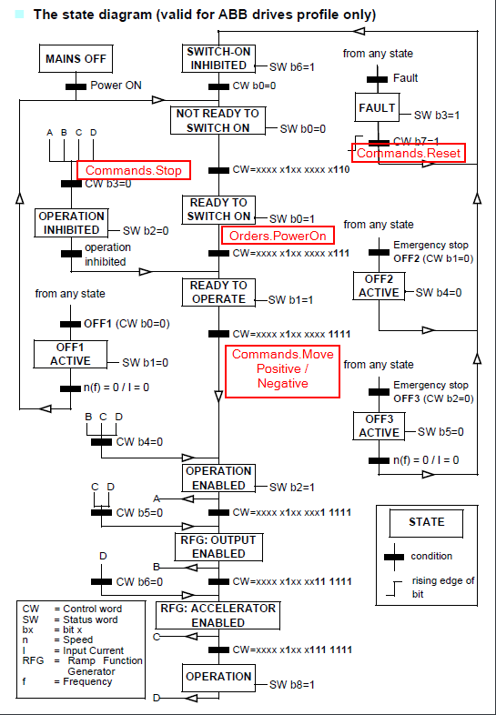

| Doc Version | Description         | Date       | Resp       |
| ----------- | ------------------- | ---------- | ---------- |
| 1.0         | First release       | 30/10/2023 | J. Alarcón |
| 1.1         | Added state diagram | 13/11/2023 | J. Alarcón |
|             |                     |            |            |

# Related documentation

[ACS380 ABB VSD](https://efi365.sharepoint.com/:f:/r/sites/inkjet/cretaprint/oficinatecnica2/Lean%20Product%20Development/Controls/05%20Interesting%20data/ACS380%20ABB%20VSD?csf=1&web=1&e=WfV23F)

[Nice video for dummies](https://search.abb.com/library/Download.aspx?DocumentID=9AKK107492A3782&LanguageCode=en&DocumentPartId=&Action=Launch)

# How to use the package

Commands:

| Name         | Type    | Description                                 |
| ------------ | ------- | ------------------------------------------- |
| MovePositive | BOOLEAN | Starts a movement in the positive direction |
| MoveNegative | BOOLEAN | Starts a movement in the negative direction |
| Stop         | BOOLEAN | Stops the movement                          |
| Reset        | BOOLEAN | Acknowledges and quits all errors           |

Parameters:

| Name                | Type  | Description                                                                                                             |
| ------------------- | ----- | ----------------------------------------------------------------------------------------------------------------------- |
| Hardware.CpuFamilty | USINT | Used for simulation                                                                                                     |
| ControlMode         | UINT  | 0-Escalar, 1-Vectorial.                                                                                                 |
| Type                | ENUM  | INV_BR : For BR invertert                        INV_ABB : For ABB inverter                                             |
| Velocity            | INT   | Motor speed setpoint  [rpm]                                                                                             |
| DecTime             | DINT  | Time for deceleration ramp [s]. A value of 0 force the VSD to apply de max deceleration without overloading the CC bus. |
| AccTime             | DINT  | Time for acceleration ramp [s].  A value of 0 force the VSD to apply the max acceleration.                              |

ElecSignals.In:

| Name       | Type    | Description                               |
| ---------- | ------- | ----------------------------------------- |
| xBreakerOK | BOOLEAN | EFI Signal: Circuit breaker protection Ok |

Status:

| Name            | Type    | Description                                          |
| --------------- | ------- | ---------------------------------------------------- |
| Velocity        | INT     | Angular speed read from the VSD [rpm]                |
| Current         | REAL    | Motor current consumption [A]                        |
| StatusDisabled  | BOOLEAN | The inverter is switched off                         |
| StatusReady     | BOOLEAN | The motor is stopped and ready to perform a movement |
| StatusOperation | BOOLEAN | The motor is running or in quick stop                |
| StatusErrorStop | BOOLEAN | The inverter has some error                          |
| ReadyForOrders  | BOOLEAN | The inverter can receive a movement command.         |
| ErrorID         | UINT    | Error number                                         |
| ErrorText       | STRING  | Error description                                    |
| ErrorComms      | BOOLEAN | Communication error                                  |

# State diagram

Internal VSD state diagram (source EN_ACS380_FW_H_A5 doc), added in red where the package commands applies.

 

# First installation configuration steps

From Factory Settings, with the PLC already loaded with the proper version:

1. VSD parameter 51.03 Set the node number

2. VSD parameter 51.02 Set the protocol profile = 1

3. VSD parameter 51.27 Refresh values. Set to 1 (it will change automatically to 0 after changes have taken effect). The communication will be stablished between the PLC and the VSD, but parameters will not be set.

4. VSD parameter 51.26 Set the force receive parameters from PLC = 1.

5. VSD parameter 51.27 Refresh values. Set to 1 (it will change automatically to 0 after changes have taken effect). After that, communication will be reseted and restablished.

6. Check that parameters have been set correctly, look inside motor parameters and check:
   
   1. Nominal power = 18.5 KW
   
   2. Nominal current = 34 A
   
   3. Nominal voltage = 400 V
   
   4. Nominal speed = 2955 rpm
   
   5. Nominal frequency = 50 Hz
   
   6. Cos fi = 0.85

7. Repeat steps 1, 2 and 3.

8. Check if VSD is already in local mode, if not, set it

9. Perform ID Run, it is a required tunning performed by the VSD whenever motor parameters are modified.
   
   1. Select 99.13 ID run requested, check if it is set to 3 (Standstill, no movement), if not, set it.
   
   2. An AFF6 Identification run warning message is shown. The panel LED starts to blink green to indicate an active warning.
   
   3. On the AFF6 warning, press Start to start the ID run. Do not press any control panel keys during the ID run. If you need to stop the ID run, press Stop.
   
   4. After the ID run is completed, the status light stops blinking. If the ID run fails, the panel shows the fault FF61 ID run

10. VSD parameter 96.07 Save parameters = 1, to save the parameters even after power off.

11. Check if VSD is already in remote mode, if not, set it.
